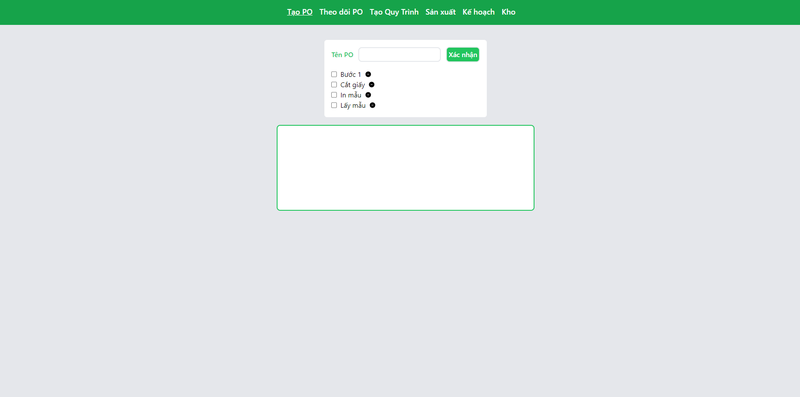
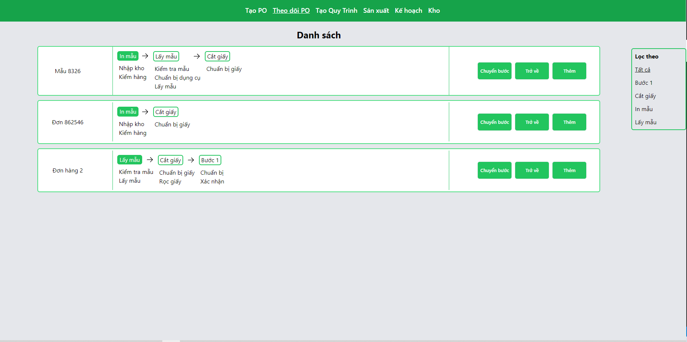
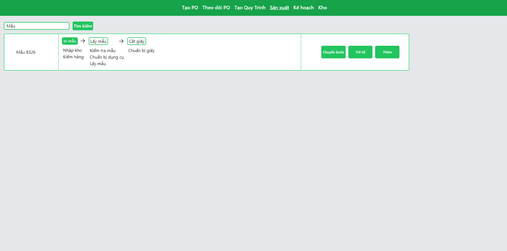
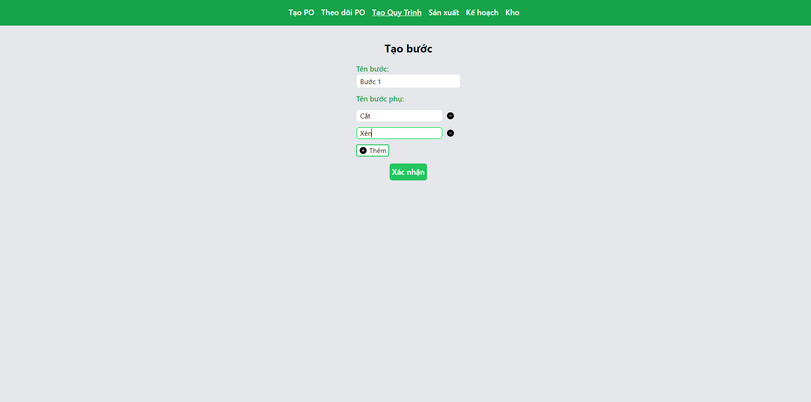
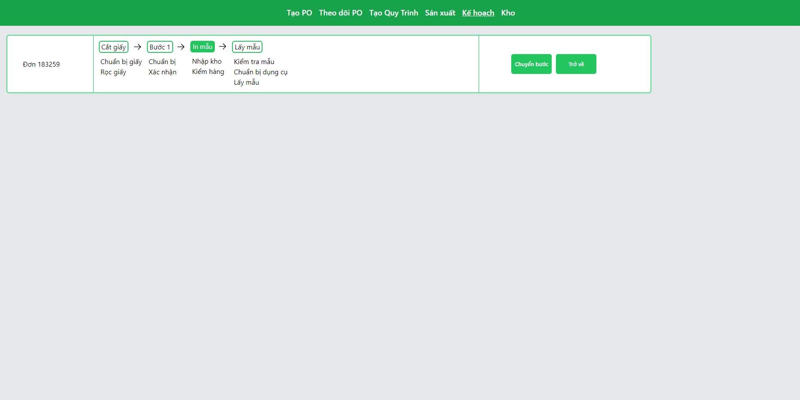

# PO Control app

Here is the live demo https://hoangluan97.github.io/PO-Tracking

A PO control apps build with Reactjs, Tailwindcss, Firebase

## Feature

- Create Purchase order and update/monitor its progress.
- Sort PO by its status, find the PO by name.
- Create production plan.
- Create custom PO process and reuse it.

## Technologies

- Reactjs
- Tailwindcss
- Firebase

## Screenshots

Create Purchase order

Monitor progress and sort PO

Find PO by name

Create custom PO process and reuse it when create PO

Production plan

## Set up

Download or clone the repository

In the project directory, you can run:

npm start
Runs the app in the development mode.
Open http://localhost:3000 to view it in the browser.

The page will reload if you make edits.
You will also see any lint errors in the console.

## Approach

I used all the stuff that I have learned recently to build this app and also applied the BEM naming style for my CSS class names. This project helped me a lot to get used to all of these new knowledge and realize what needs to be learned to develop this app and afford to carry out my new projects
